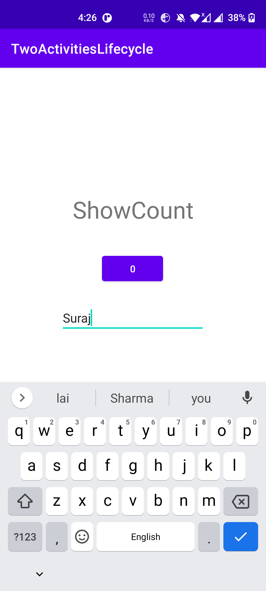
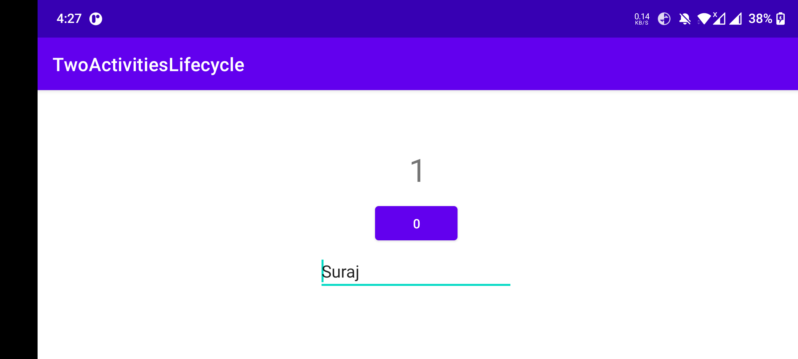

##Lab 5 ActivityLifeCycle And state

### ActivityLifeCycle Homework

**This is the interface of the application or we can say this is the landing page
**

**this is the interface where we can type the message
**

**this is the interface where we can increase the count
**

**after rotating the there is no change in state
**

